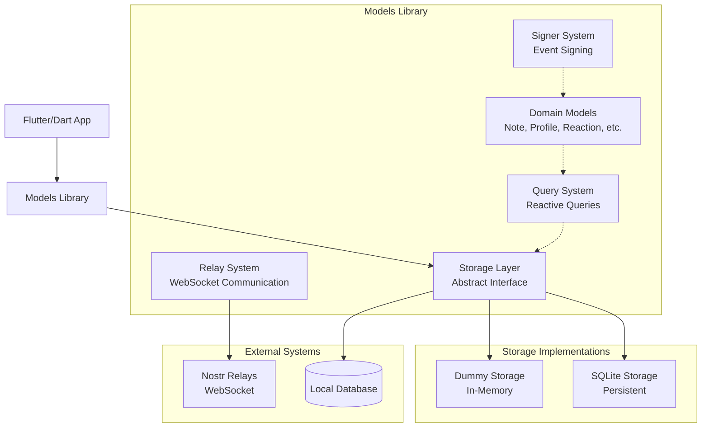
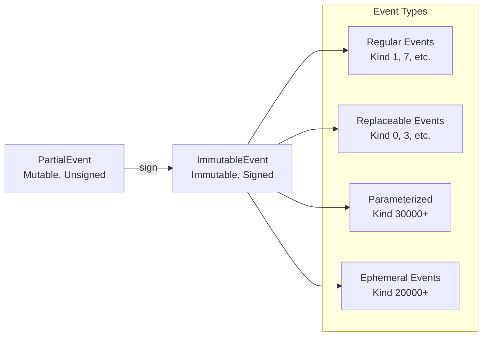
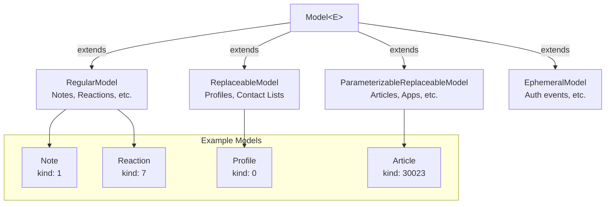
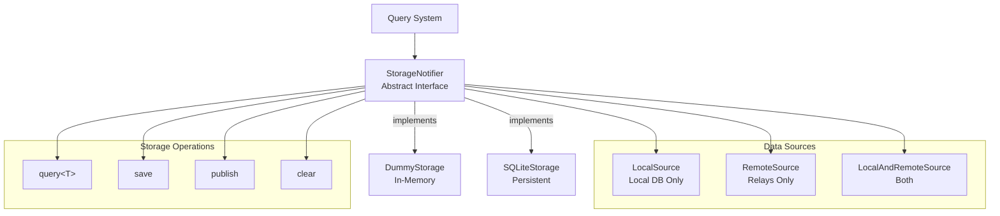
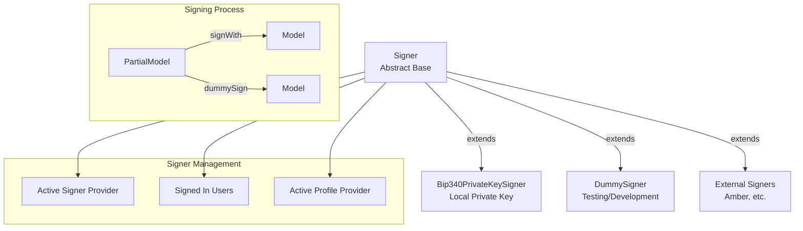
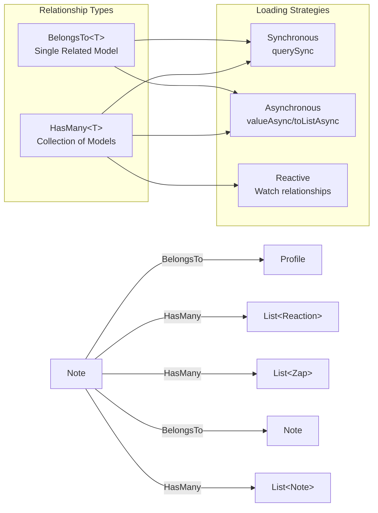
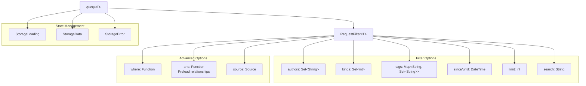
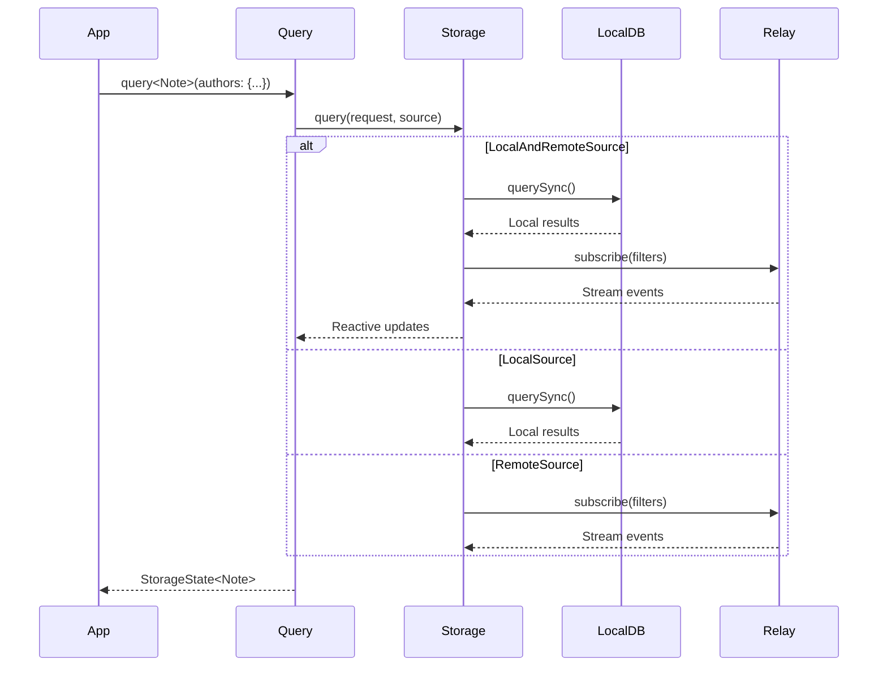
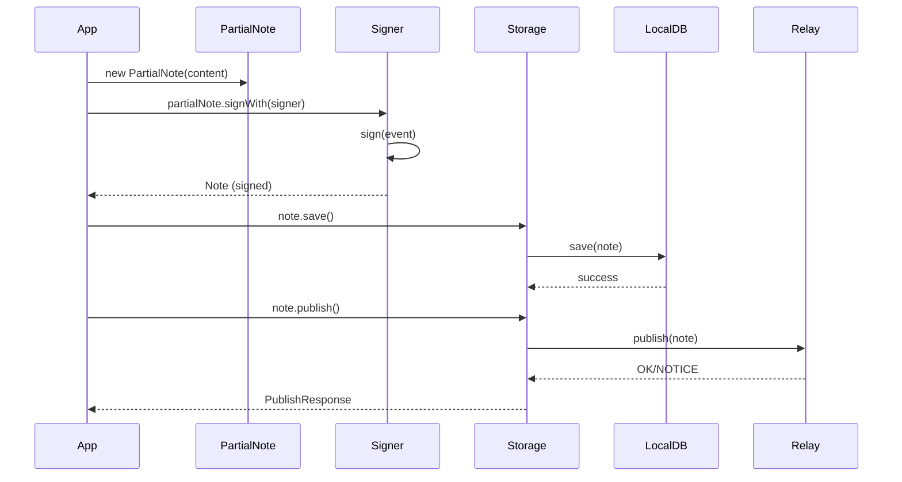
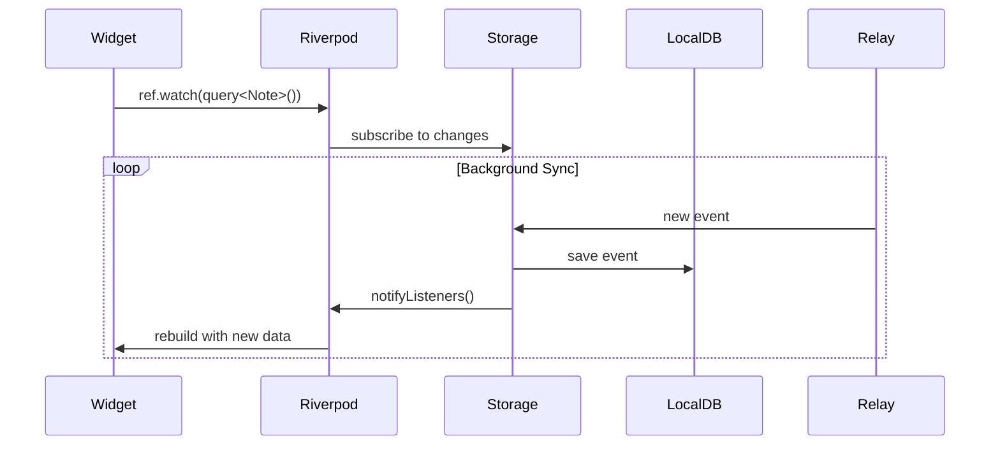

# Architecture Overview

This document provides a technical overview of the Models library - a fast, local-first Nostr framework for Dart applications.

## What is Models?

Models is a Dart library that provides a high-level, domain-driven interface for working with the Nostr protocol. It abstracts away the complexity of raw Nostr events and provides type-safe, reactive access to social media data with built-in relationships and local storage.

## Core Design Principles

1. **Domain-First**: Work with `Note`, `Profile`, `Reaction` objects instead of raw JSON events
2. **Local-First**: Data is stored locally and synchronized with relays in the background
3. **Reactive**: Built on Riverpod for reactive state management
4. **Type-Safe**: Full Dart type safety with compile-time guarantees
5. **Extensible**: Easy to add new Nostr event kinds and customize behavior

## High-Level Architecture



## Core Components

### 1. Event System

The library uses a two-phase event system:



**Key Classes:**
- `PartialEvent<E>`: Mutable, unsigned events ready for signing
- `ImmutableEvent<E>`: Signed, immutable events from storage/relays
- `EventBase<E>`: Common interface with tag utilities

### 2. Domain Models

Models wrap events and provide domain-specific interfaces:



**Key Features:**
- **Type Safety**: Each model corresponds to a specific Nostr event kind
- **Relationships**: Built-in `author`, `reactions`, `zaps` relationships
- **Metadata Processing**: Lazy parsing of complex data (e.g., zap amounts)
- **Storage Integration**: Direct `save()` and `publish()` methods

### 3. Storage Layer

The storage layer provides a unified interface for local and remote data:



**Key Features:**
- **Source Control**: Choose between local-only, remote-only, or hybrid queries
- **Reactive**: Built on Riverpod StateNotifier for reactive updates
- **Pluggable**: Easy to implement custom storage backends
- **Streaming**: Background synchronization with configurable batching

### 4. Signer System

The signer system handles event creation and signing:



**Key Features:**
- **Multiple Signers**: Support for different signing methods
- **User Management**: Track signed-in users and active profiles
- **Encryption**: NIP-04 and NIP-44 message encryption
- **Reactive**: Riverpod providers for authentication state

### 5. Relationship System

Models can reference other models through relationships:



**Key Features:**
- **Lazy Loading**: Relationships are loaded on demand
- **Type Safety**: Compile-time guarantees for relationship types
- **Caching**: Efficient caching of relationship queries
- **Reactive**: Can be watched for changes

### 6. Query System

Reactive queries provide a familiar interface similar to Nostr filters:



**Usage Example:**
```dart
final notesState = ref.watch(
  query<Note>(
    authors: {userPubkey},
    limit: 20,
    since: DateTime.now().subtract(Duration(days: 7)),
    and: (note) => {note.author, note.reactions, note.zaps},
  ),
);
```

## Data Flow

### 1. Reading Data



### 2. Creating Data



### 3. Reactive Updates



## Key Design Patterns

### 1. Domain-Driven Design
- **Models**: Rich domain objects with behavior
- **Value Objects**: Immutable data structures (Events)
- **Repositories**: Storage abstraction layer
- **Services**: Signers, verifiers, utilities

### 2. CQRS (Command Query Responsibility Segregation)
- **Commands**: `save()`, `publish()`, `sign()`
- **Queries**: `query<T>()`, relationship navigation
- **Separate Models**: `PartialModel` for commands, `Model` for queries

### 3. Event Sourcing
- **Immutable Events**: All changes represented as events
- **Append-Only**: Events are never modified, only added
- **Replay**: Models can be reconstructed from events

### 4. Reactive Programming
- **Streams**: Continuous data flow from relays
- **Observables**: Riverpod providers for state management
- **Declarative**: UI declares what data it needs

## Extension Points

### 1. Custom Event Kinds

```dart
@GeneratePartialModel()
class CustomEvent extends RegularModel<CustomEvent> {
  CustomEvent.fromMap(super.map, super.ref) : super.fromMap();
  
  String get customField => event.getFirstTagValue('custom') ?? '';
}

// Register in storage initialization
Model.register(kind: 40000, constructor: CustomEvent.fromMap);
```

### 2. Custom Storage Backend

```dart
class CustomStorage extends StorageNotifier {
  @override
  Future<void> initialize(StorageConfiguration config) async {
    super.initialize(config); // Register built-in types
    // Custom initialization
  }
  
  @override
  Future<List<E>> query<E extends Model<dynamic>>(
    Request<E> req, {Source source = const LocalAndRemoteSource()}
  ) async {
    // Custom query implementation
  }
  
  // Implement other abstract methods...
}
```

### 3. Custom Signer

```dart
class CustomSigner extends Signer {
  @override
  Future<List<E>> sign<E extends Model<dynamic>>(
    List<PartialModel<Model<dynamic>>> partialModels
  ) async {
    // Custom signing logic
  }
  
  // Implement encryption methods...
}
```

## Performance Considerations

1. **Lazy Loading**: Relationships are loaded on demand
2. **Caching**: Local storage acts as a cache layer
3. **Streaming**: Background sync with configurable batching
4. **Memory Management**: Configurable limits on stored models
5. **Signature Optimization**: Optional signature stripping for space

## Testing Strategy

1. **Dummy Implementation**: Built-in in-memory storage for testing
2. **Dummy Signer**: No-op signer for development
3. **Fake Data**: Built-in faker integration for generating test data
4. **Mocking**: Easy to mock storage and signer interfaces

---

This architecture provides a solid foundation for building Nostr applications in Dart while maintaining flexibility for customization and extension. 